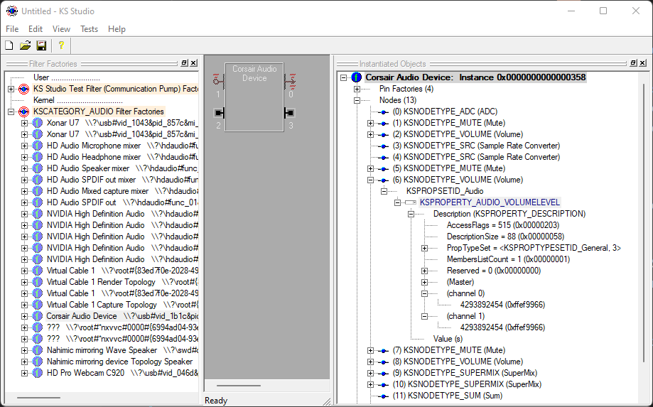
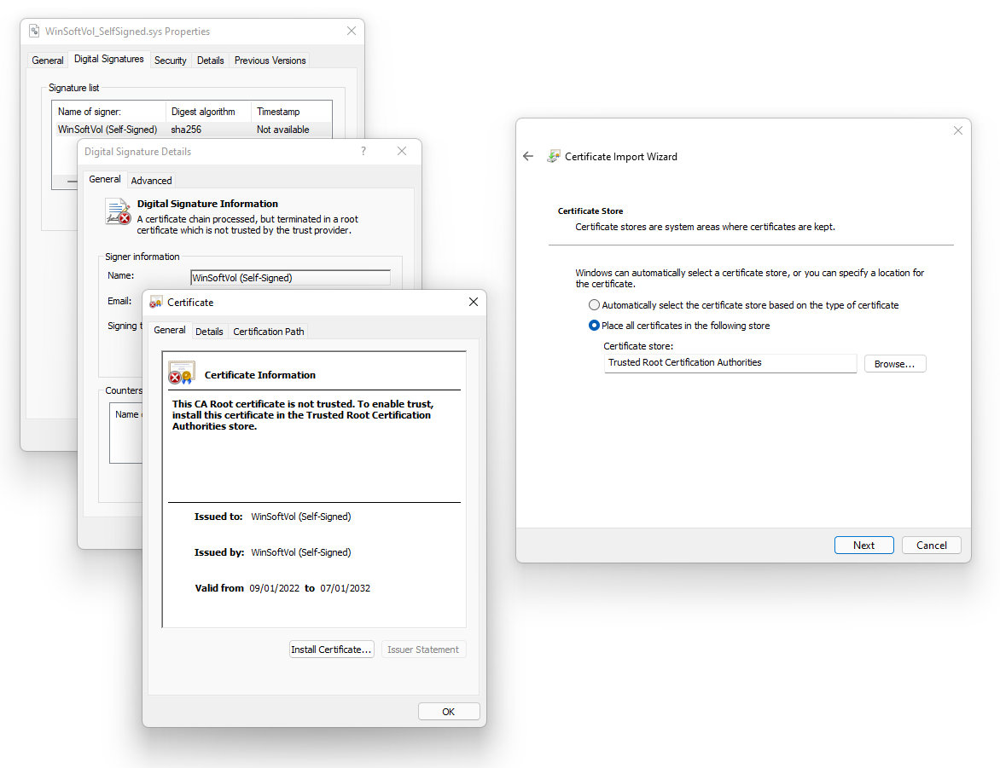
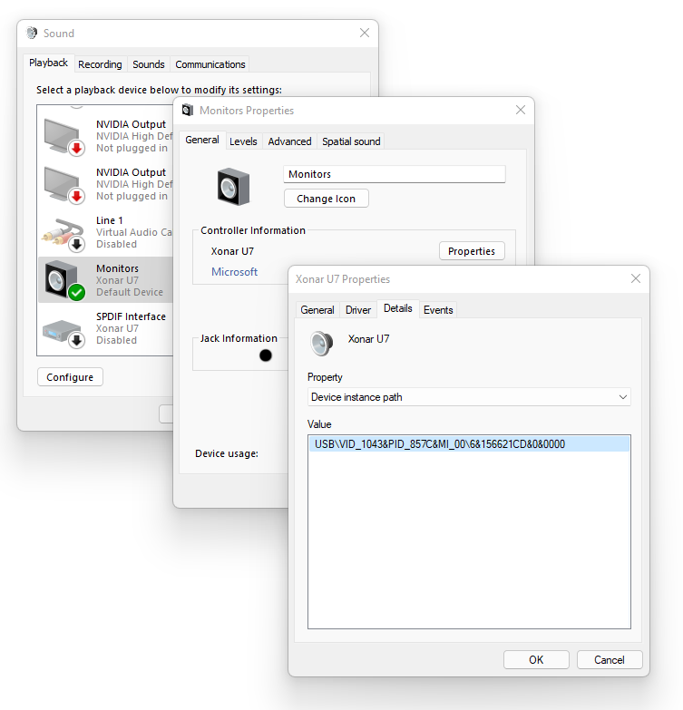
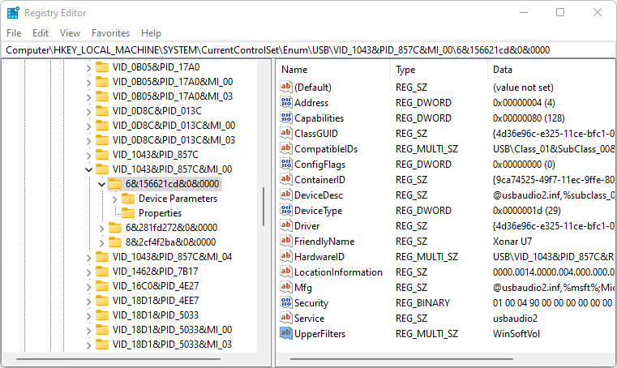
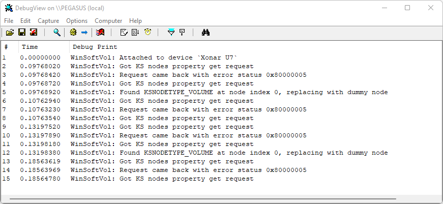

# WinSoftVol: force Windows software volume control

*Brought to you by [Etienne Dechamps][] - [GitHub][]*

## Description

The goal of WinSoftVol is to stop Windows from using the hardware volume control
that most audio devices provide, forcing Windows to use its own
[software volume control][] mechanism instead. See also [example use
cases](#example-use-cases).

WinSoftVol takes the form of a [filter driver][] that can be inserted on top of
any audio device driver. It works by intercepting hardware volume control
queries from the Windows audio engine before they make their way to the audio
device driver.

This project can also serve as a nice [code sample][] for a trivial,
minimalistic [Kernel Streaming][] [WDF][] [filter driver][msfilter].

## Why would I possibly want to use this?

That's a good question. To be honest, unless you find yourself in one of the
[example situations](#example-use-cases) described below, it is unlikely you'd
want to go through the hassle of deploying WinSoftVol. It is only useful in a
very narrow set of scenarios.

Broadly, there are two main reasons why you'd want to use WinSoftVol:

- The volume control your hardware provides is unsatisfactory.
  - For example, some devices (e.g. FiiO E7) expose a volume control that
    doesn't work at all, leaving the Windows volume control inoperative.
- You want to exploit the fact that Windows software volume control operates on
  the same *floating-point* samples that the rest of the Windows audio engine
  (in particular, [APOs][]) operates on.
  - This can be used to [avoid clipping][] in some scenarios described in more
    detail below.

### Using software volume control to avoid clipping in the Windows audio engine

**A note about "clipping"**: this document uses the term "clipping" somewhat
liberally. Technically the Windows audio engine never really lets its output
"clip" because the final stage goes through a little-known limiting filter known
as [CAudioLimiter][] right before conversion to integer. This filter mitigates
the worse effects of clipping by redistributing the nasty-sounding harmonics so
that they become likely to be masked by the human auditory system. Subjectively,
CAudioLimiter appears to be quite effective at making clipping much more
difficult to notice. This explains why "clipping" in the Windows audio engine
output doesn't really sound like digital clipping at all - though obviously this
filter is not magic and one can still tell that the signal level is being
limited. To keep things digestible, this document uses the term "clipping"
throughout, even though what is really meant is "limited by CAudioLimiter".

To understand how Windows software volume control can be used to prevent digital
clipping in specific scenarios, you need to keep in mind the following:

- All Windows audio processing occurs inside the Windows audio engine. The
  Microsoft docs include a number of [diagrams][] that help visualize this. This
  processing notably includes:
  - Mixing audio from multiple applications playing at the same time;
  - APOs, for example [Equalizer APO][];
  - Software volume control, if hardware volume control isn't used.
- The Windows audio engine internally operates on 32-bit floating-point audio
  samples - not integer samples as you would find them on, say, a CD.
  - If an application sends integer samples, the first thing Windows does is
    convert them to floating-point first.
  - Windows converts between floating-point and the configured sample format
    for the device (e.g. 16-bit or 24-bit integer) as the very last step of
    processing (for playback) or the very first step (for recording).
- One fundamental difference between floating-point samples and the (way more
  commonplace) integer samples is that floating-point samples *cannot clip*. In
  other words, they have (virtually) *infinite headroom*.
  - This is because the "full range" of floating point audio samples is defined,
    by convention, as -1.0 to +1.0. But [floating-point][] can go much, much
    below -1.0, and much, much above +1.0. This means it is possible to *exceed
    full range* on floating-point samples *without clipping*. This is
    fundamentally impossible when using integer samples, because their "full
    range" is defined as the maximum range the chosen integer size can hold.
  - This is one reason why floating-point is a popular sample format for filter
    chains, such as those used in the Windows audio engine: they prevent
    clipping that could otherwise occur *between* the filters.

Now at this point you might be wondering where we're going with this. After all,
these floating-point samples have to be converted to integer eventually so that
a DAC can play them. Integer samples do not have infinite headroom, and neither
does the DAC. Out-of-range floating-point samples will therefore clip as soon
as they are converted to integer. So what is the point of all this?

The point is to make the volume control smarter by making it attenuate samples
*before* they clip. Let me explain:

#### Detailed example scenario

Imagine you're using hardware volume control, as would be the case with most
Windows audio devices. You're playing content that happens to be quite loud
(i.e. low headroom), such as unnormalized popular music. Because it is loud, you
lower the Windows volume control to compensate. That volume control is hardware,
meaning it attenuates samples *after* they've been converted to integer and sent
to your DAC.

Now, let's also assume that something in the Windows audio engine (e.g. an APO)
increases the signal gain on top of that already "loud" content. The resulting
floating-point samples are likely to exceed full range. Here's the problem:
these out-of-range floating-point samples will *stay out of range* when the
final conversion to integer is taking place and *they will clip*! Your audio
hardware still has plenty of output level headroom available, but that extra
headroom *sits there unused* because of the device's own hardware volume
control.

[![Hardware volume control graph][hardvolgraph]][hardvolgraph]

"Okay", I hear you say, "well I'll just add some attenuation to the APO to
prevent clipping then, no big deal". Sure, you could do that, but now you have
the opposite problem. Let's say you're now playing "quiet" (i.e. high headroom)
content, such as most movies or normalized music. The problem is, now the output
is too quiet because of the attenuation you just added! Even with the volume
control at 100%, the output level is still insufficient.

Now, of course you could just switch the attenuation on and off depending on
which type of content you're playing. So, if you're playing "loud" content (with
the volume control set low), you enable attenuation to prevent clipping, and if
you're playing "quiet" content (with the volume control set high), you disable
it to increase output level, knowing that because the content is quiet, it's
unlikely to clip.

Obviously it would be quite annoying to have to toggle that attenuation all the
time. But what if I told you that could happen *automatically and
transparently*, in such a way as to always exploit the full dynamic range of the
system, no matter what type of content you're playing?

This is what Windows software volume control does. When software volume control
is used, the master Windows volume control does not act on the hardware. Instead
it acts on a volume control APO that Windows automatically inserts *inside the
Windows audio engine*, right *before* the samples are converted to integer -
and therefore, *before* they clip. In other words, the Windows volume control
itself *replaces* the "anti-clipping" attenuation we've described above.

[![Software volume control graph][softvolgraph]][softvolgraph]

Here's what happens when you use Windows software volume control:

- If you're playing "loud" content, with the volume control set low,
  floating-point samples in the Windows audio engine will be *automatically
  and transparently* attenuated, and thus prevented from clipping, by the
  software volume control APO.
- If you're playing "quiet" content, with the volume control set high and where
  clipping is unlikely, no unnecessary attenuation takes place and you get to
  use the full dynamic range of your audio hardware.

This is what WinSoftVol allows you to do. It forces Windows to ignore the "dumb"
hardware volume control and to use its own "smart" software volume control
instead.

#### Example use cases

If the above example doesn't resonate with you, here are some situations where
clipping could be prevented by using software volume control:

- **Volume boosting**
  - If you are stuck with an audio device that has weak output (e.g. laptop
    speakers), you might be tempted to add some digital gain to the Windows
    audio pipeline (e.g. using [Equalizer APO][]) to compensate. That might
    give acceptable results when applications output "quiet" content, but it
    will clip horribly the moment you use an application that outputs "loud"
    (i.e. full range) content. (Actually it won't sound *that* bad thanks to
    CAudioLimiter, but still.)
  - In contrast, if you use software volume control, you can ensure the output
    will only clip when it *actually* exceeds the maximum hardware output level.
- **Simplifying gain staging in APOs** (e.g. EQ)
  - If you run APOs that do advanced signal filtering, such as audio EQ, you
    are probably familiar with the problem of avoiding clipping due to
    additional signal gain brought on by the filters.
  - WinSoftVol makes it possible to completely forget about this problem: you
    don't need any anti-clipping attenuation stage. Software volume control
    *is* the anti-clipping attenuation stage. The only limit becomes what the
    DAC can physically output, allowing you to use the full dynamic range of
    your system and simplifying your [gain structure][].
  - This is what I personally use WinSoftVol for. I use [Equalizer APO][] to
    apply system-wide room equalization to all audio signals coming out of my
    PC, and combine that with WinSoftVol to avoid the need for anti-clipping
    attenuation in the EQ filter chain.
- **Mixing audio from multiple applications**
  - If multiple applications all output full-range audio at the same time, the
    output of the Windows audio engine will clip… unless you attenuate in an
    APO, which is precisely what software volume control does.
- **Mitigating the effects of CAudioLimiter**
  - Audio purists might want to avoid full-range content from being affected by
    the [CAudioLimiter][] filter, which is always present in the Windows audio
    pipeline.
  - The effects of CAudioLimiter are negligible on signals whose peak value is
    below approx. -0.1 dBFS. Naturally, software volume control operates
    *before* CAudioLimiter. Therefore, as long as the software volume control is
    set to strictly less than 100%, CAudioLimiter is effectively bypassed.
- **Mitigating the effects of intersample peaks**
  - [Intersample peaks][] are only a potential problem if the true peaks are
    beyond full scale. Because software volume control attenuates the digital
    signal, setting the volume control at -3 dB or below effectively makes this
    issue moot.
  - This might or might not be the case when using hardware volume control as
    well, depending on how the volume control is implemented in the actual
    device.
- **Applications producing floating-point samples**
  - It is technically possible for applications themselves to deliver
    floating-point samples directly to the Windows audio engine, avoiding the
    initial conversion from integer.
  - It is not clear how many applications do this. One example is
    [foobar2000][].
  - If applications can stream floating-point samples, it follows that they
    can output *out of range* samples. These out-of-range samples are likely to
    clip if hardware volume control is used, but they might not if software
    volume control is used.

## Why would I *NOT* want to use this?

- You might be lucky enough to use an audio device that does not provide
  hardware volume control in the first place, making WinSoftVol unnecessary.
  - Note that this is quite rare - most audio devices do advertise hardware
    volume control.
  - However there might be specific cases, especially when dealing with audio
    devices that are not DACs (such as digital-to-digital converters, e.g. USB
    to S/PDIF, HDMI outputs) where the device might not implement hardware
    volume control.
  - You can check if your device provides hardware volume control using one
    of the techniques described in the [next
    section](#how-do-i-know-if-im-currently-using-software-volume-control).
  - If you are already using software volume control, then you're all set and
    WinSoftVol will be of no use for you.
- Software volume control is not magic: it can only provide benefits if you
  actually *use* the volume control.
  - If you always leave the Windows volume control at 100% (e.g. because you set
    the volume at a different stage, say an amplifier), software volume control
    basically does nothing and obviously won't help with clipping.
  - Likewise, if you always leave the volume control set to a constant value and
    never touch it, software volume control is equivalent to setting up an APO
    that attenuates samples by the same value. [Equalizer APO][], for example,
    is much easier to set up than WinSoftVol.
- When WinSoftVol is installed on a device, that device's own hardware volume
  control becomes inaccessible.
  - This is especially problematic if the default value for the hardware volume
    control is not 100%, which might happen for some devices.
  - Technically the hardware volume control can still be set manually using
    KsStudio (see next section), but that won't persist across device resets or
    reboots.
  - This is a limitation of WinSoftVol that could potentially be fixed. Feel
    free to file a [feature request][] if you are affected.
- WinSoftVol affects all inputs and outputs of a given audio device.
  - There is no way to tell WinSoftVol to disable hardware volume control on
    only some of the inputs and outputs ("[audio endpoints][]" in Windows
    parlance) of an audio device ("audio adapter").
  - This is a limitation of WinSoftVol that could potentially be fixed. Feel
    free to to file a [feature request][] if you are affected.
- Software volume control does not work if the Windows audio engine is bypassed.
  - Most notably, it won't work with applications that use WASAPI Exclusive,
    Kernel Streaming, or native ASIO. The Windows volume control will not affect
    such applications anymore.
  - Applications that bypass the Windows audio engine are rare and specialized.
    If you don't know that you are using one of those, you likely aren't.
- DACs are generally designed to operate with digital signal levels in some
  expected "reasonable" range, e.g. -60 to 0 dBFS.
  - Software volume control shifts the digital signal level down by a large
    amount (e.g. 50% volume is about -10 dB, 25% is about -20 dB), moving it
    farther away from the DAC's optimal range of operation.
  - This can potentially affect sound quality. The most obvious issue would be
    a raised noise floor. A more subtle issue might be exacerbating
    [DAC non-linearities][] in the small signal range.
  - Some audio devices implement hardware volume control in such a way that
    these problems still apply even when using hardware volume control, making
    this point moot.
  - If you use a DAC that was measured (e.g. by [ASR][]) to have good noise
    floor and linearity, you can probably ignore this problem.

## How do I know if I'm currently using software volume control?

Use one of the following techniques to determine if Windows is using software or
hardware volume control. This can be used to check the "native" behaviour of an
audio device, or to check that WinSoftVol is working as intended.

### Testing with WASAPI Exclusive

Use any application that offers a "WASAPI Exclusive" output mode; for example
[foobar2000][] with the [WASAPI plug-in][].

If the Windows volume control works while playing audio in WASAPI Exclusive
mode, you are using hardware volume control. If the volume control does nothing,
you are using software volume control.

This is because software volume control operates inside the Windows audio
engine, which is completely bypassed when WASAPI Exclusive is used.

### Using KsStudio

Microsoft provides the [KsStudio utility][] which can be used to examine
low-level technical details of Windows audio devices. The utility can be found
in the [Windows Driver Kit][], in the "Tools" directory, under the name
`ksstudio.exe`.

KsStudio might display a number of warning messages and prompts on startup - you
can usually ignore all of them.

Use the left hand pane to locate the KS filter factory that corresponds to your
device. There might be more than one; you'll have to check all of them.

With a KS filter selected, on the right hand side, you are looking for a
`KSNODETYPE_VOLUME` *node*. For example:



If WinSoftVol is active on the device, then what you will see instead is a
`GUID_NULL` node. This is because WinSoftVol does not *remove* nodes, as that
would disrupt the KS topology and create a mess. Instead, WinSoftVol *hides* the
volume node by changing its identifier to a dummy "null" identifier, which is
ignored by the Windows audio engine.

Note that depending on the specific device involved, your picture might look
quite different from this example. You might have more than one matching node,
because your audio device might have multiple inputs and outputs. In that case,
figuring out which node (if any) is relevant might be challenging as you will
need to take the topology of the KS filter into account. However, if you see at
least one `KSNODETYPE_VOLUME` node, it's probably safe to assume hardware volume
control is being used.

If you can't find a relevant `KSNODETYPE_VOLUME` node, then your audio device
is not exposing any hardware volume control.

#### Manipulating the hardware volume control

Using KsStudio you can read and set the value (as in, the actual level) of the
hardware volume control. You can do this even with WinSoftVol enabled (using the
properties below the "hidden" `GUID_NULL` node).

The values for the hardware volume control itself are displayed by KsStudio
under "channel (0)" and "channel (1)" in the above screenshot. [Interpreting
these values][KSPROPERTY_AUDIO_VOLUMELEVEL] is a bit complicated - these are
signed integers using [two's complement][], so you will need to take the
hexadecimal value (the part after `0x` in parentheses) and plug it into a
[converter][hexa]. In the above screenshot, the raw value is `ffef9966` which
translates to `-1074842`. Divide by 65536 to get the value in decibels. In this
case the hardware volume control is set to -16.4 dB, and that value should match
the one in the Windows audio settings (if you are *not* using WinSoftVol, of
course).

You can change the hardware volume control by clicking on the value. You will
need to follow the same conversion rules in reverse. Note that any changes you
make will likely not survive a device reset or reboot.

## Installing WinSoftVol

### Prerequisites

- Windows Vista or later (32-bit or 64-bit)
  - It was only tested on Windows 11 though.
- Any audio device that is recognized as such by Windows
- Lots of patience and willingness to get your hands dirty

### Step 0: prepare the computer to load self-signed drivers

Contrary to typical drivers, WinSoftVol does NOT meet the [Microsoft signing
requirements] for Windows kernel-mode drivers. This is because getting a driver
signed by Microsoft is a significant undertaking that requires a non-trivial
amount of money.

This is a problem because modern versions of Windows (especially 64-bit, Windows
10+) will simply refuse to load a driver that is not signed by Microsoft. This
includes WinSoftVol.

There are two known ways of working around this requirement:

- Boot Windows in [Test Signing Mode][].
  - **WARNING: this has security implications. Enable test mode at your own
    risk.** Test Signing Mode allows *any* driver to be loaded on the system -
    this includes WinSoftVol, but it also includes potential malware. *If
    malware manages to load a kernel-mode driver, it's game over for your
    system.* Outside of test mode, a malicious kernel mode driver would need to
    somehow obtain a Microsoft signature in order to load. Within test mode,
    this barrier is lifted and all it takes is just Administrator access on the
    machine. Most notably, this significantly compromises the security benefits
    offered by [Secure Boot][]. *You have been warned.*
- Or use the "[licensing workaround][]" to circumvent the Microsoft signing
  requirement.
  - This is somewhat of a hack that is not supported by Microsoft at all, and
    could stop working at any moment.
  - However, contrary to Test Mode, it does allow you to run any unsigned driver
    without compromising the security of your system.
  - Unfortunately this approach is quite difficult to put in practice, as the
    procedure is very complicated and technically challenging.
  - If you want to do this, you will likely want to use [SSDE][].

If you still want to proceed after reading the above, then you are extremely
motivated, brave, or foolish.

The following steps assume you are operating in Test Signing Mode. You will need
to adjust them appropriately if you went for a different approach.

### Step 1: download the driver

Go to the WinSoftVol [releases page][] and download the appropriate `.sys` file
for your system - x86 for 32-bit, x64 for 64-bit. Copy the file to an
appropriate location that the driver will run from (`C:\Program Files` is a good
choice).

### Step 2: trust the signature

Windows will not trust the driver's signature by default, even in Test Signing
Mode. To make that happen you need to add the driver's certificate to the
appropriate store.

Go to the Properties of the `.sys` file, *Digital Signatures* tab, *Details*,
*View Certificate*, *Install Certificate…*, *Local Machine*, *Next*, *Place all
certificates in the following store*, select the *Trusted Root Certification
Authorities* store, *Next*, and *Finish*.



Close the file properties and open them again. If you go to the certificate
details again, Windows should now show the certificate as valid.

### Step 3: create the kernel service

Windows drivers run as kernel-mode services that are managed by the [Service
Control Manager][], similar to the typical Windows services you might be used
to. They are not shown in the Services control panel though, so we need to use
the Windows built-in `sc.exe` command line tool to manage them.

Run the following on the Windows command line:

```
sc.exe create WinSoftVol "binPath=c:\YOUR\PATH\TO\WinSoftVol_x64_SelfSigned.sys" type=kernel
```

### Step 4: take the kernel service for a test run

This step is not strictly necessary as the Windows Device Manager (specifically,
[PNP][]) will start the service automatically as needed. However this is an easy
way to determine if Windows is happy to load the driver:

```
sc.exe start WinSoftVol
```

The command should return a `STATE` of `RUNNING`. If it returns an error,
something is wrong and you need to retrace your steps. The most likely causes
are:

- A problem with the signature, see step 0 and step 2.
  - For example you might not be in Test Signing Mode.
- The `binPath` in the previous step is incorrect.
  - Delete the service using `sc.exe delete WinSoftVol` and try again.
- Another possibility is that you picked the wrong `.sys` file (e.g. `x86`
  instead of `x64`).

### Step 5: identify your audio adapter device

Go to the Sound control panel (the old Windows Vista/7 one, not the new one),
then go to the Properties of the output device you are interested in. Go to
*Properties* under *Controller Information*, then *Details* tab,
*Device instance path*.



Make a note of that path; you will need it later. Right-click to copy it to the
clipboard.

**Note:** WinSoftVol operates at the *adapter device* level; it will disable
hardware volume control on *all endpoints* (i.e. inputs and outputs) that are
present on the selected device.

### Step 6: attach WinSoftVol to the device

**Note:** before you proceed any further, you might want to set your device's
(currently hardware) volume control to 100%. Otherwise it might remember its
current value and you won't be able to easily change it later.

In the Registry Editor, navigate to:

```
HKEY_LOCAL_MACHINE\SYSTEM\CurrentControlSet\Enum\<YOUR DEVICE INSTANCE PATH>
```

Add a new Multi-String Value called `UpperFilters` with a single line:
`WinSoftVol`.



**Note:** in the (unlikely) event there is already an `UpperFilters` value, just
append `WinSoftVol` to it on a separate line.

**Note:** after this step, if you are somehow running into trouble and your
device appears to be corrupted or nonfunctional, go to the *Device Manager*,
*Uninstall* the device and then use *Scan for hardware changes* in the *Actions*
menu to reinstate it. This will reset the registry settings for this device.

#### Alternative: install WinSoftVol class-wide

If you wish, you can have Windows automatically attach WinSoftVol to *all* audio
devices on the system, present and future. This effectively means hardware
volume control will be disabled on all your devices.

One benefit of this approach is that WinSoftVol will survive audio device driver
updates.

To do this, instead of adding the `UpperFilters` value in the device-specific
registry key, add it in the `MEDIA` device class registry key instead, which is
located here:

```
HKEY_LOCAL_MACHINE\SYSTEM\CurrentControlSet\Control\Class\{4d36e96c-e325-11ce-bfc1-08002be10318}
```

**CAUTION:** if you mess things up in this registry key, there is no going back.
Make a backup of the key (*File*, *Export…*) before you proceed.

You will likely find there is already a `UpperFilters` value defined there,
containing the line `ksthunk`. **Do NOT remove existing lines.** Instead, add
WinSoftVol on a separate line before or after them. The order doesn't really
seem to matter.

A change to this registry key takes effect on individual devices as they are
restarted (see next step), or the system is rebooted.

### Step 7: restart the device

In order for Windows (PNP) to pick up the change you just made in the registry,
the device needs to be restarted. Use the Windows built-in [PnPUtil][] command
line utility to do that:

```
pnputil.exe /restart-device "<YOUR DEVICE INSTANCE ID>"
```

### Step 8: restart the Windows audio engine

This step is not always necessary, but it appears the Windows audio engine
sometimes gets a bit confused if the properties of an audio device are changing
right from under it.

Go to Windows Services and restart the *Windows Audio* (`audiosrv`) service.

### Step 9: wrapping up

That's it! Windows should now be using software volume control with your device.
Follow the [instructions
above](#how-do-i-know-if-im-currently-using-software-volume-control) to confirm
this.

If it doesn't appear to work, or if your audio device has been rendered
inoperable, follow the [troubleshooting section](#troubleshooting) below.

If you want to use WinSoftVol on more than one device (and you didn't use the
class-wide method) simply resume from step 6.

**Note:** unless you used the class-wide method in step 6, WinSoftVol will not
survive driver updates. If you update the audio device driver you will need to
resume from step 6 to get WinSoftVol back.

### Uninstalling

To detach WinSoftVol from an audio device, revert the registry change you made
in step 6 above, then continue with steps 7 and 8.

To completely remove WinSoftVol from the system, detach it from all active
audio devices first, then delete the service:

```
sc.exe delete WinSoftVol
```

If this command fails, it likely means WinSoftVol is still in use on at least
one device.

You can then delete the `.sys` file. You might also want to remove the driver
certificate from the Windows Certificate Store.

### Troubleshooting

If the Device Manager reports an error with the device, you might want to
[double check that WinSoftVol can
load](#step-4-take-the-kernel-service-for-a-test-run).

If WinSoftVol does load, verify that Windows does see it as an upper filter
driver for the device:


(If you used the class-wide approach, you will find it under *Class upper
filters* instead.)

You can also check kernel messages logged by the driver using [DebugView][]. 
Make sure the *Capture Kernel* and *Enable Verbose Kernel Output* options are
enabled. A healthy output will look like this after a restart of the device:



You might also want to [look at the device using
KsStudio](#manipulating-the-hardware-volume-control).

If none of this helps, you might want to [file an issue][] and ask for help.

## Acknowledgments

Many thanks to Windows driver specialists **Tim Roberts** and **Doron Holan**
who [provided great assistance][] while I was struggling to understand the
strange behaviour of Kernel Streaming requests.

[ASR]: https://www.audiosciencereview.com/forum/index.php?forums/digital-to-analog-dac-reviews-and-discussion.10/
[APOs]: https://docs.microsoft.com/en-us/windows-hardware/drivers/audio/audio-processing-object-architecture
[audio endpoints]: https://docs.microsoft.com/en-us/windows/win32/coreaudio/audio-endpoint-devices
[avoid clipping]: https://www.audiosciencereview.com/forum/index.php?threads/ending-the-windows-audio-quality-debate.19438/page-16#post-1025696
[CAudioLimiter]: https://www.audiosciencereview.com/forum/index.php?threads/ending-the-windows-audio-quality-debate.19438/
[code sample]: src/
[DAC non-linearities]: https://www.audiosciencereview.com/forum/index.php?threads/how-important-is-dac-linearity.7878/
[DebugView]: https://docs.microsoft.com/en-us/sysinternals/downloads/debugview
[diagrams]: https://docs.microsoft.com/en-us/windows-hardware/drivers/audio/audio-processing-object-architecture#audio-processing-objects-architecture
[Etienne Dechamps]: mailto:etienne@edechamps.fr
[Equalizer APO]: https://sourceforge.net/projects/equalizerapo/
[feature request]: https://github.com/dechamps/WinSoftVol/issues
[file an issue]: https://github.com/dechamps/WinSoftVol/issues
[filter driver]: https://en.wikipedia.org/wiki/Filter_driver
[floating-point]: https://en.wikipedia.org/wiki/Single-precision_floating-point_format
[foobar2000]: https://www.foobar2000.org/
[gain structure]: https://www.minidsp.com/applications/dsp-basics/gain-structure-101
[GitHub]: https://github.com/dechamps/WinSoftVol
[intersample peaks]: https://splice.com/blog/what-are-inter-sample-peaks/
[hexa]: https://www.rapidtables.com/convert/number/hex-to-decimal.html
[Kernel Streaming]: https://docs.microsoft.com/en-us/windows-hardware/drivers/stream/kernel-streaming
[KsStudio utility]: https://docs.microsoft.com/en-us/windows-hardware/drivers/audio/ksstudio-utility
[licensing workaround]: https://www.geoffchappell.com/notes/windows/license/customkernelsigners.htm
[Microsoft signing requirements]: https://docs.microsoft.com/en-us/windows-hardware/drivers/install/kernel-mode-code-signing-requirements--windows-vista-and-later-
[KSPROPERTY_AUDIO_VOLUMELEVEL]: https://docs.microsoft.com/en-us/windows-hardware/drivers/audio/ksproperty-audio-volumelevel
[msfilter]: https://docs.microsoft.com/en-us/windows-hardware/drivers/kernel/filter-drivers
[PNP]: https://docs.microsoft.com/en-us/windows-hardware/drivers/kernel/introduction-to-plug-and-play
[PnPUtil]: https://docs.microsoft.com/en-us/windows-hardware/drivers/devtest/pnputil
[provided great assistance]: https://community.osr.com/discussion/293297
[releases page]: https://github.com/dechamps/WinSoftVol/releases
[Secure Boot]: https://docs.microsoft.com/en-us/windows-hardware/design/device-experiences/oem-secure-boot
[Service Control Manager]: https://docs.microsoft.com/en-us/windows/win32/services/service-control-manager
[software volume control]: https://docs.microsoft.com/en-us/windows-hardware/drivers/audio/software-volume-control-support
[SSDE]: https://github.com/valinet/ssde
[test signing mode]: https://docs.microsoft.com/en-us/windows-hardware/drivers/install/the-testsigning-boot-configuration-option
[two's complement]: https://en.wikipedia.org/wiki/Two%27s_complement
[WASAPI plug-in]: https://www.foobar2000.org/components/view/foo_out_wasapi
[WDF]: https://docs.microsoft.com/en-us/windows-hardware/drivers/wdf/
[Windows Driver Kit]: https://docs.microsoft.com/en-us/windows-hardware/drivers/download-the-wdk

<!-- Use the converter at http://gravizo.com/ to recover the source code of
these graphs. -->
[hardvolgraph]: https://g.gravizo.com/svg?digraph%20G%20%7B%0A%09rankdir%3D%22LR%22%0A%09fontname%3D%22sans-serif%22%0A%09node%5Bfontname%3D%22sans-serif%22%5D%0A%09edge%5Bfontname%3D%22sans-serif%22%5D%0A%09%09style%3D%22invis%22%0A%0A%09App%5Blabel%3D%22Application%22%20group%3D%22stream%22%5D%0A%09subgraph%20cluster%20%7B%0A%09%09style%3D%22filled%22%0A%09%09label%3D%22Windows%20audio%20engine%22%0A%0A%09%09IntFP%5Blabel%3D%22Integer%20to%5Cnfloating-point%5Cnconversion%22%20group%3D%22stream%22%5D%0A%09%09Mix%5Blabel%3D%22Mixing%22%20group%3D%22g%22%5D%0A%09%09APO%5Blabel%3D%22APOs%22%20group%3D%22g%22%5D%0A%09%09FPInt%5Blabel%3D%22Floating-point%5Cnto%20integer%5Cnconversion%22%20group%3D%22stream%22%5D%0A%09%7D%0A%09Device%5Blabel%3D%22Audio%20device%5Cnwith%20hardware%5Cnvolume%20control%22%20group%3D%22stream%22%5D%0A%0A%09Volume%5Blabel%3D%22Windows%20master%5Cnvolume%20control%22%20style%3D%22dashed%22%5D%0A%0A%09App-%3EIntFP%5Blabel%3D%22int%22%5D%0A%09IntFP-%3EMix%5Blabel%3D%22FP%22%5D%0A%09Mix-%3EAPO%5Blabel%3D%22FP%22%5D%0A%09APO-%3EFPInt%5Blabel%3D%22FP%5Cn(likely%20out%20of%20range)%22%5D%0A%09FPInt-%3EDevice%5Blabel%3D%22int%5Cn(likely%20clipped)%22%5D%0A%09Volume-%3EDevice%5Blabel%3D%22Acts%20on%22%20style%3D%22dashed%22%20arrowhead%3D%22vee%22%5D%0A%7D
[softvolgraph]: https://g.gravizo.com/svg?digraph%20G%20%7B%0A%09rankdir%3D%22LR%22%0A%09fontname%3D%22sans-serif%22%0A%09node%5Bfontname%3D%22sans-serif%22%5D%0A%09edge%5Bfontname%3D%22sans-serif%22%5D%0A%09%09style%3D%22invis%22%0A%0A%09App%5Blabel%3D%22Application%22%20group%3D%22stream%22%5D%0A%09subgraph%20cluster%20%7B%0A%09%09style%3D%22filled%22%0A%09%09label%3D%22Windows%20audio%20engine%22%0A%0A%09%09IntFP%5Blabel%3D%22Integer%20to%5Cnfloating-point%5Cnconversion%22%20group%3D%22stream%22%5D%0A%09%09Mix%5Blabel%3D%22Mixing%22%20group%3D%22g%22%5D%0A%09%09APO%5Blabel%3D%22APOs%22%20group%3D%22g%22%5D%0A%09%09SoftVol%5Blabel%3D%22Software%20volume%5Cncontrol%20APO%22%2C%20group%3D%22stream%22%5D%0A%09%09FPInt%5Blabel%3D%22Floating-point%5Cnto%20integer%5Cnconversion%22%20group%3D%22stream%22%5D%0A%09%7D%0A%09Device%5Blabel%3D%22Audio%20device%22%20group%3D%22stream%22%5D%0A%0A%09Volume%5Blabel%3D%22Windows%20master%5Cnvolume%20control%22%20style%3D%22dashed%22%5D%0A%0A%09App-%3EIntFP%5Blabel%3D%22int%22%5D%0A%09IntFP-%3EMix%5Blabel%3D%22FP%22%5D%0A%09Mix-%3EAPO%5Blabel%3D%22FP%22%5D%0A%09APO-%3ESoftVol%5Blabel%3D%22FP%5Cn(possibly%20out-of-range)%22%5D%0A%09SoftVol-%3EFPInt%5Blabel%3D%22FP%5Cn(likely%20within%20range)%22%5D%0A%09FPInt-%3EDevice%5Blabel%3D%22int%5Cn(likely%20unclipped)%22%5D%0A%09Volume-%3ESoftVol%5Blabel%3D%22Acts%20on%22%20style%3D%22dashed%22%20arrowhead%3D%22vee%22%5D%0A%7D%0A
